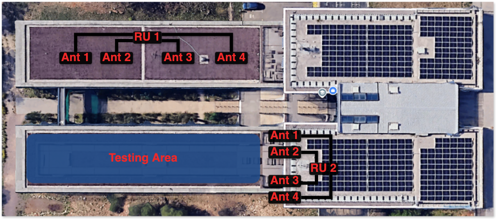

# 5g-DT-results
 
Raw per-position results from UL-TDoA positioning experiments run against a
ray-traced digital twin of the GEO-5G testbed at EURECOM.
 
Each file records the outcome of one sweep: sixteen scripted UE positions,
each solved once by the OpenAirInterface Location Management Function (LMF)
over a channel computed by Sionna RT and delivered to an unmodified OAI stack
through `vrtsim`. Because the emulator is deterministic and adds no noise,
re-running a sweep under identical conditions reproduces these values exactly
rather than to within a tolerance.
 
## Repository layout
 
```
oai-configs/   gNB configuration used for each sweep
results/       per-position output of each sweep
```
 
Eight sweeps: two scenes, two bandwidth configurations, two antenna layouts.
Each row below is one sweep, and the two files on it belong together.
 
| Scene | Layout | BW | gNB configuration | Result |
|---|---|---|---|---|
| EURECOM | two-height | 40 MHz | `gnb.sa.band78.fr1.106PRB.positioning.conf` | `results_EURECOM_106b.csv` |
| EURECOM | two-height | 100 MHz | `gnb.sa.band78.fr1.273PRB.positioning.conf` | `results_EURECOM_273b.csv` |
| Munich | two-height | 40 MHz | `gnb.sa.band78.fr1.106PRB.positioning.munich.conf` | `results_munich_106b.csv` |
| Munich | two-height | 100 MHz | `gnb.sa.band78.fr1.273PRB.positioning.munich.conf` | `results_munich_273b.csv` |
| EURECOM | height-diverse | 40 MHz | `gnb.sa.band78.fr1.106PRB.positioning.diffz.conf` | `results_eurecom_diffz_106b.csv` |
| EURECOM | height-diverse | 100 MHz | `gnb.sa.band78.fr1.273PRB.positioning.diffz.conf` | `results_eurecom_diffz_273b.csv` |
| Munich | height-diverse | 40 MHz | `gnb.sa.band78.fr1.106PRB.positioning.munich.diffz.conf` | `results_munich_diffz_106b.csv` |
| Munich | height-diverse | 100 MHz | `gnb.sa.band78.fr1.273PRB.positioning.munich.diffz.conf` | `results_munich_diffz_273b.csv` |
 
The filename fields decompose as
`gnb.sa.band78.fr1.<PRB>PRB.positioning[.munich][.diffz].conf`: absent
`munich` means the EURECOM scene, absent `diffz` means the two-height
layout. Result filenames follow the same scheme,
`results_<scene>[_diffz]_<PRB>b.csv`. Note that the scene field is
capitalised as `EURECOM` in the two-height files and `eurecom` in the
height-diverse ones; on a case-sensitive filesystem a script must match
either spelling.
 
## Column reference
 
| Column | Units | Meaning |
|---|---|---|
| `index` | | Position number within the sweep, 1 to 16 |
| `timestamp` | ISO 8601 | When the fix was recorded |
| `target_x`, `target_y`, `target_z` | m | Position requested through the emulator's scenario API |
| `gt_x`, `gt_y`, `gt_z` | m | Ground truth, the position at which the channel was actually computed |
| `est_x`, `est_y`, `est_z` | m | Position returned by the LMF |
| `error_2d_m` | m | Horizontal error, `hypot(est_x - gt_x, est_y - gt_y)` |
| `error_3d_m` | m | Three-dimensional error including the height component |
 
`target_*` and `gt_*` are identical in every row of every file. Both are kept
because they are distinct in principle: the target is what was requested, the
ground truth is what the emulator placed. Their agreement is what makes the
ground truth exact.
 
Coordinates are in the scene frame, the same frame as the antenna positions
below. All test positions are at `z = 1.7` m.
 
The signed height error is not a column; compute it as `est_z - gt_z`.
 
## Antenna geometry
 

 
*The physical GEO-5G deployment: RU1 and RU2, four elements each, with the
area used for the hardware campaign marked. Site map reproduced from the
EURECOM 5G SRS dataset, IEEE Dataport, DOI 10.21227/t8ya-z141.*
 
The map shows the deployment the EURECOM scene reproduces. The two-height
layout below corresponds to it; the height-diverse layout does not exist
physically and was evaluated only in the twin. The Munich scene uses the same
array in an unrelated environment and has no counterpart on the ground.
 
Eight gNB elements in two collinear sub-arrays of four. Sub-array A spans
36.0 m with 9.0, 18.0 and 9.0 m spacings; sub-array B spans 15.0 m with 5.0 m
spacings. The two axes are orthogonal and the horizontal centroid separation
is 42.19 m. The Munich array is the image of the EURECOM array under a
distance-preserving transform, so every quantity the solver's conditioning
depends on is identical between the two scenes.
 
The two layouts differ **only** in the eight element heights. Horizontal
coordinates are untouched.
 
Two-height layout, heights `(1.7, 1.7, 1.7, 1.7, 12.5, 12.5, 12.5, 12.5)` m.
Height-diverse layout, heights `(1.7, 12.0, 1.7, 12.0, 12.5, 32.0, 12.5, 32.0)` m.
 
EURECOM, height-diverse (x, y, z in metres):
 
```
 -6.0000, 19.0000,  1.7000
-11.9045, 25.7924, 12.0000
-23.7136, 39.3772,  1.7000
-29.6181, 46.1695, 12.0000
-23.7088, 69.8567, 12.5000
-19.9352, 73.1370, 32.0000
-16.1617, 76.4172, 12.5000
-12.3881, 79.6975, 32.0000
```
 
Munich, height-diverse:
 
```
184.0000, 136.0000,  1.7000
191.7942, 131.5000, 12.0000
207.3827, 122.5000,  1.7000
215.1769, 118.0000, 12.0000
237.3013, 128.3205, 12.5000
239.8013, 132.6507, 32.0000
242.3012, 136.9807, 12.5000
244.8012, 141.3109, 32.0000
```
 
For the two-height layouts, replace the *z* column with 1.7 for the first four
elements and 12.5 for the last four.
 
## gNB configuration files
 
Each file in `oai-configs/` is the complete gNB configuration for one sweep,
including the TRP coordinates the LMF receives over NRPPa. Four of them differ
from the other four only in those coordinates, since the two antenna layouts
share their horizontal positions and differ only in element height.
 
Two points are worth knowing before anyone tries to reproduce a sweep from
these files.
 
**The deployment geometry is declared twice.** The ray tracer places the
antennas from the emulator's scenario file, in metres; the LMF places them
from the `gNBs.[0].positioning` block of these configuration files, in
centimetres. Nothing enforces agreement between the two. A discrepancy would
not raise an error, it would appear as a positioning bias indistinguishable
from poor measurement quality, so the two must be checked against each other
by hand.
 
**Not everything that matters is in these files.** The SRS IDFT oversampling
factor is a compile-time constant in the gNB source, not a configuration
parameter, and it differs between the two bandwidth configurations for the
reason given below. A sweep reproduced from these files alone, against an
unmodified gNB, will not return the values in `results/`.
 
Six further parameters differ between the 106PRB and 273PRB files beyond the
bandwidth itself: `p0_nominal`, `p0_NominalWithGrant`, `hoppingId`, the PRACH
configuration index, `preambleReceivedTargetPower` and `powerRampingStep`.
Four of these govern random access only and play no part in SRS measurement.
The two uplink power-control targets differ by 6 dB; re-running one
configuration with both set to the other's value reproduced all sixteen fixes
exactly, so they do not affect the results reported here.
 
## Radio configuration
 
| | 40 MHz | 100 MHz |
|---|---|---|
| Resource blocks, 30 kHz SCS | 106 | 273 |
| Occupied bandwidth | 38.16 MHz | 98.28 MHz |
| OAI sample rate | 61.44 MHz | 122.88 MHz |
| Emulated tap spacing | 16.28 ns (4.88 m) | 8.14 ns (2.44 m) |
| SRS IDFT oversampling factor | 8 | 4 |
| Delay-estimate bin | 2.03 ns (0.61 m) | 2.03 ns (0.61 m) |
 
Carrier 3.6192 GHz, band n78. Tap window 71 taps, absolute delays, no delay
normalisation. Eight transmit and eight receive antenna ports.
 
The oversampling factor differs between the two configurations so that both
place the correlation peak on the same 0.61 m bin spacing. It is a
compile-time constant and is not exposed through any configuration file; at
its released value the two configurations would quantise delay differently and
the bandwidth comparison would be confounded. The asymmetry is forced by stack
allocation in the L1 receive thread.
 
## Verification
 
Parse the files and you should reproduce these exactly. If you don't, the
parse is wrong.
 
| File | mean | median | 90th | max | < 1.5 m | RMS Δz |
|---|---|---|---|---|---|---|
| `results_EURECOM_106b.csv` | 1.28 | 1.20 | 1.77 | 3.81 | 11/16 | 3.50 |
| `results_EURECOM_273b.csv` | 1.15 | 0.95 | 1.80 | 2.73 | 12/16 | 3.70 |
| `results_munich_106b.csv` | 2.62 | 0.98 | 5.39 | 19.07 | 11/16 | 2.31 |
| `results_munich_273b.csv` | 1.04 | 0.71 | 2.32 | 3.70 | 13/16 | 2.19 |
| `results_eurecom_diffz_106b.csv` | 1.24 | 1.03 | 2.62 | 3.52 | 12/16 | 0.85 |
| `results_eurecom_diffz_273b.csv` | 1.54 | 0.85 | 4.47 | 5.73 | 11/16 | 1.02 |
| `results_munich_diffz_106b.csv` | 1.22 | 0.84 | 2.34 | 3.79 | 12/16 | 0.95 |
| `results_munich_diffz_273b.csv` | 1.29 | 0.56 | 3.52 | 6.20 | 14/16 | 0.63 |
 
Horizontal error statistics are over `error_2d_m`; RMS Δz is over
`est_z - gt_z`. The 90th percentile is computed by linear interpolation
between order statistics, numpy's default. With sixteen constructed positions
it rests on effectively two points and is not a population-level reliability
estimate.
 
## Reading the data
 
Two things are easy to get wrong.
 
**These are biases, not noise realisations.** The emulator is deterministic
with zero noise power, so at a given position the pipeline returns the same
answer every time. Quantiles here describe how error varies with geometry
across sixteen fixed positions, not how it would vary under repeated
measurement at one point. Averaging repeated runs cannot reduce the error.
 
**The two scenes cannot be differenced position by position.** Each set of
sixteen positions was chosen independently within its scene, so the tracks are
not in correspondence. The scenes can be compared in aggregate only.
 
## Software state
 
All three repositories were used at their `develop` branch.
 
| Component | Repository | Branch |
|---|---|---|
| Ray-tracing channel emulator | `gitlab.eurecom.fr/oai/raytracing-channel-emulator` | `develop` |
| OAI `openairinterface5g` | `gitlab.eurecom.fr/oai/openairinterface5g` | `develop` |
| OAI LMF | see the OAI positioning repository | `develop` |
 
Two things are not captured by a branch name and are needed to reproduce
these results.
 
The SRS IDFT oversampling factor is a compile-time constant in the gNB
source, set to 8 for the 106PRB configuration and 4 for the 273PRB one. Its
released value is 2. Without this change the two bandwidth configurations
quantise delay differently and the comparison between them is confounded.
 
The reported results also depend on modifications to the LMF solver and to
the gNB arrival-time estimator. `develop` moves, so a reader checking out
these branches at a later date will not necessarily obtain the code that
produced the files in `results/`. Recording the commit hash of each
repository at the time of the sweeps would pin them; that is the one piece
of provenance this repository does not yet carry.
 
## Citation
 
If you use this data, please cite the paper it supports:
 
> N. Chaharbaghi, F. Kaltenberger, B. Podrygajlo and R. Mundlamuri,
> "A Ray-Traced Digital Twin for UL-TDoA Positioning in a
> Distributed-Antenna 5G Testbed," submitted to the 21st IEEE/IFIP Wireless
> On-Demand Network Systems and Services Conference (WONS), 2027.
 
```bibtex
@inproceedings{chaharbaghi2027digitaltwin,
  author    = {Chaharbaghi, Nima and Kaltenberger, Florian and
               Podrygajlo, Bartosz and Mundlamuri, Rakesh},
  title     = {A Ray-Traced Digital Twin for {UL-TDoA} Positioning in a
               Distributed-Antenna {5G} Testbed},
  booktitle = {21st IEEE/IFIP Wireless On-Demand Network Systems and
               Services Conference (WONS)},
  year      = {2027},
  note      = {Submitted}
}
```
 

