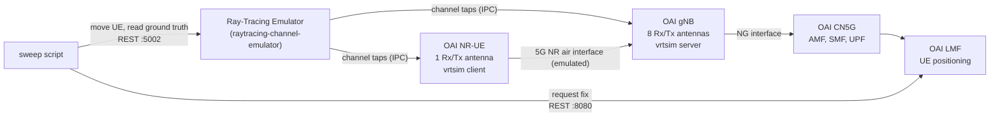

<!-- SPDX-License-Identifier: CC-BY-4.0 -->

# 5g-DT-results

UL-TDoA positioning sweeps run against a ray-traced digital twin of the GEO-5G
testbed at EURECOM.

This repository holds everything needed to read the results and to reproduce
them: the per-position output of every sweep, the gNB configuration that
produced each one, the scripts that drive a sweep, and a walkthrough of the
full stack from a clean machine.

A sweep drives sixteen scripted UE positions through an unmodified
OpenAirInterface (OAI) 5G stack whose radio channel is computed by Sionna RT
over a 3D model of the site and delivered to the softmodems through `vrtsim`.
The UE position is scripted rather than surveyed, so the ground truth carries
no uncertainty of its own, and the emulator is deterministic, so a sweep
repeated under identical conditions reproduces its values exactly rather than
to within a tolerance.

**Contents**
 
- [1. Repository layout](#1-repository-layout)
- [2. The experiment](#2-the-experiment)
  - [2.1 Antenna geometry](#21-antenna-geometry)
  - [2.2 Radio configuration](#22-radio-configuration)
- [3. Results](#3-results)
  - [3.1 Column reference](#31-column-reference)
  - [3.2 Verification](#32-verification)
  - [3.3 Reading the data](#33-reading-the-data)
- [4. Reproducing a sweep](#4-reproducing-a-sweep)
  - [4.1 System overview](#41-system-overview)
  - [4.2 Prerequisites](#42-prerequisites)
  - [4.3 Ray-tracing channel emulator](#43-ray-tracing-channel-emulator)
  - [4.4 OAI gNB and NR-UE](#44-oai-gnb-and-nr-ue)
  - [4.5 OAI CN5G and the LMF](#45-oai-cn5g-and-the-lmf)
  - [4.6 Launch order](#46-launch-order)
  - [4.7 Running the sweep](#47-running-the-sweep)
  - [4.8 Shutdown](#48-shutdown)
- [5. Troubleshooting](#5-troubleshooting)
- [6. Software state](#6-software-state)
- [7. Citation](#7-citation)
- [8. Licence](#8-licence)
---
 


## 1. Repository layout

```
oai-configs/   gNB configuration used for each sweep
results/       per-position output of each sweep
sweep/         sweep driver, test position files, LMF request body
eurecom_map.png
README.md
```

Eight sweeps: two scenes, two bandwidth configurations, two antenna layouts.
Each row below is one sweep, and the files on it belong together.

| Scene | Layout | BW | gNB configuration | Result |
|---|---|---|---|---|
| EURECOM | two-height | 40 MHz | `gnb.sa.band78.fr1.106PRB.positioning.conf` | `results_EURECOM_106b.csv` |
| EURECOM | two-height | 100 MHz | `gnb.sa.band78.fr1.273PRB.positioning.conf` | `results_EURECOM_273b.csv` |
| Munich | two-height | 40 MHz | `gnb.sa.band78.fr1.106PRB.positioning.munich.conf` | `results_munich_106b.csv` |
| Munich | two-height | 100 MHz | `gnb.sa.band78.fr1.273PRB.positioning.munich.conf` | `results_munich_273b.csv` |
| EURECOM | height-diverse | 40 MHz | `gnb.sa.band78.fr1.106PRB.positioning.diffz.conf` | `results_eurecom_diffz_106b.csv` |
| EURECOM | height-diverse | 100 MHz | `gnb.sa.band78.fr1.273PRB.positioning.diffz.conf` | `results_eurecom_diffz_273b.csv` |
| Munich | height-diverse | 40 MHz | `gnb.sa.band78.fr1.106PRB.positioning.munich.diffz.conf` | `results_munich_diffz_106b.csv` |
| Munich | height-diverse | 100 MHz | `gnb.sa.band78.fr1.273PRB.positioning.munich.diffz.conf` | `results_munich_diffz_273b.csv` |

Filenames decompose as
`gnb.sa.band78.fr1.<PRB>PRB.positioning[.munich][.diffz].conf` and
`results_<scene>[_diffz]_<PRB>b.csv`: absent `munich` means the EURECOM scene,
absent `diffz` means the two-height layout. The scene field is capitalised as
`EURECOM` in the two-height results and `eurecom` in the height-diverse ones,
which matters on a case-sensitive filesystem.

---

## 2. The experiment

### 2.1 Antenna geometry


*The physical GEO-5G deployment: RU1 and RU2, four elements each, with the area
used for the hardware campaign marked. Site map reproduced from the EURECOM 5G
SRS dataset, IEEE Dataport, DOI 10.21227/t8ya-z141.*

Eight gNB elements in two collinear sub-arrays of four. Sub-array A spans
36.0 m with 9.0, 18.0 and 9.0 m spacings; sub-array B spans 15.0 m with 5.0 m
spacings. The two axes are orthogonal and the horizontal centroid separation is
42.19 m. The Munich array is the image of the EURECOM array under a
distance-preserving transform, so every quantity the solver's conditioning
depends on is identical between the two scenes.

The two layouts differ **only** in the eight element heights; horizontal
coordinates are untouched. The two-height layout corresponds to the physical
deployment. The height-diverse layout does not exist physically and was
evaluated only in the twin.

| Layout | Heights (m) |
|---|---|
| two-height | 1.7, 1.7, 1.7, 1.7, 12.5, 12.5, 12.5, 12.5 |
| height-diverse | 1.7, 12.0, 1.7, 12.0, 12.5, 32.0, 12.5, 32.0 |

EURECOM, height-diverse (x, y, z in metres):

```
 -6.0000, 19.0000,  1.7000
-11.9045, 25.7924, 12.0000
-23.7136, 39.3772,  1.7000
-29.6181, 46.1695, 12.0000
-23.7088, 69.8567, 12.5000
-19.9352, 73.1370, 32.0000
-16.1617, 76.4172, 12.5000
-12.3881, 79.6975, 32.0000
```

Munich, height-diverse:

```
184.0000, 136.0000,  1.7000
191.7942, 131.5000, 12.0000
207.3827, 122.5000,  1.7000
215.1769, 118.0000, 12.0000
237.3013, 128.3205, 12.5000
239.8013, 132.6507, 32.0000
242.3012, 136.9807, 12.5000
244.8012, 141.3109, 32.0000
```

For the two-height layouts, replace the *z* column with 1.7 for the first four
elements and 12.5 for the last four.

### 2.2 Radio configuration

| | 40 MHz | 100 MHz |
|---|---|---|
| Resource blocks, 30 kHz SCS | 106 | 273 |
| Occupied bandwidth | 38.16 MHz | 98.28 MHz |
| OAI sample rate | 61.44 MHz | 122.88 MHz |
| Emulated tap spacing | 16.28 ns (4.88 m) | 8.14 ns (2.44 m) |
| SRS IDFT oversampling factor | 8 | 4 |
| Delay-estimate bin | 2.03 ns (0.61 m) | 2.03 ns (0.61 m) |

Carrier 3.6192 GHz, band n78. Tap window 71 taps, absolute delays, no delay
normalisation. Eight transmit and eight receive antenna ports.

The oversampling factor differs between the two configurations so that both
place the correlation peak on the same 0.61 m bin spacing. It is a
**compile-time constant**, `NR_SRS_IDFT_OVERSAMP_FACTOR` in
`openair1/PHY/defs_gNB.h`, not a configuration parameter, and its released
value is 2. Without this change the two configurations quantise delay
differently and the bandwidth comparison is confounded. The asymmetry is
forced by stack allocation in the L1 receive thread: factor 8 at 273 PRB
exhausts the stack.

---

## 3. Results

### 3.1 Column reference

| Column | Units | Meaning |
|---|---|---|
| `index` | | Position number within the sweep, 1 to 16 |
| `timestamp` | ISO 8601 | When the fix was recorded |
| `target_x`, `target_y`, `target_z` | m | Position requested through the emulator's scenario API |
| `gt_x`, `gt_y`, `gt_z` | m | Ground truth, the position at which the channel was actually computed |
| `est_x`, `est_y`, `est_z` | m | Position returned by the LMF |
| `error_2d_m` | m | Horizontal error, `hypot(est_x - gt_x, est_y - gt_y)` |
| `error_3d_m` | m | Three-dimensional error including the height component |

`target_*` and `gt_*` are identical in every row of every file. Both are kept
because they are distinct in principle: the target is what was requested, the
ground truth is what the emulator placed. Their agreement is what makes the
ground truth exact.

Coordinates are in the scene frame, the same frame as the antenna positions
above. All test positions are at `z = 1.7` m. The signed height error is not a
column; compute it as `est_z - gt_z`.

### 3.2 Verification

Parse the files and you should reproduce these exactly. If you don't, the parse
is wrong.

| File | mean | median | 90th | max | < 1.5 m | RMS Δz |
|---|---|---|---|---|---|---|
| `results_EURECOM_106b.csv` | 1.28 | 1.20 | 1.77 | 3.81 | 11/16 | 3.50 |
| `results_EURECOM_273b.csv` | 1.15 | 0.95 | 1.80 | 2.73 | 12/16 | 3.70 |
| `results_munich_106b.csv` | 2.62 | 0.98 | 5.39 | 19.07 | 11/16 | 2.31 |
| `results_munich_273b.csv` | 1.04 | 0.71 | 2.32 | 3.70 | 13/16 | 2.19 |
| `results_eurecom_diffz_106b.csv` | 1.24 | 1.03 | 2.62 | 3.52 | 12/16 | 0.85 |
| `results_eurecom_diffz_273b.csv` | 1.54 | 0.85 | 4.47 | 5.73 | 11/16 | 1.02 |
| `results_munich_diffz_106b.csv` | 1.22 | 0.84 | 2.34 | 3.79 | 12/16 | 0.95 |
| `results_munich_diffz_273b.csv` | 1.29 | 0.56 | 3.52 | 6.20 | 14/16 | 0.63 |

Horizontal error statistics are over `error_2d_m`; RMS Δz is over
`est_z - gt_z`. The 90th percentile is computed by linear interpolation between
order statistics, numpy's default. With sixteen constructed positions it rests
on effectively two points and is not a population-level reliability estimate.

### 3.3 Reading the data

Two things are easy to get wrong.

**These are biases, not noise realisations.** The emulator is deterministic with
zero noise power, so at a given position the pipeline returns the same answer
every time. Quantiles here describe how error varies with geometry across
sixteen fixed positions, not how it would vary under repeated measurement at
one point. Averaging repeated runs cannot reduce the error.

**The two scenes cannot be differenced position by position.** Each set of
sixteen positions was chosen independently within its scene, so the tracks are
not in correspondence. The scenes can be compared in aggregate only.

---

## 4. Reproducing a sweep

The remainder of this README is a walkthrough from a clean machine. It follows
the OAI digital-twin tutorial and adds the sweep step.

### 4.1 System overview



The emulator holds the scene and computes propagation; `vrtsim` replaces the RF
hardware in both softmodems; the LMF returns a position estimate over the
`nlmf-loc` API. The sweep script moves the UE and requests a fix at each of the
sixteen positions, writing one CSV row per position.

IPC socket topology:

```
raytracing-channel-emulator (main.py)
        |
        |--- ipc:///tmp/ru_socket_0  ---->  gNB (vrtsim server)
        |
        |--- ipc:///tmp/ue_socket_0  ---->  UE  (vrtsim client)
```

### 4.2 Prerequisites

- Ubuntu 22.04 or 24.04 LTS, x86_64, 8 or more cores at 3.5 GHz or above
- 32 GB RAM. No RF hardware: the channel is fully emulated
- A CUDA-capable GPU for Sionna RT
- Docker and Docker Compose, Python 3.8 or later, Git, and the OAI build
  dependencies

### 4.3 Ray-tracing channel emulator

```bash
git clone https://gitlab.eurecom.fr/oai/raytracing-channel-emulator.git
cd raytracing-channel-emulator
git checkout origin/eurecom_simulation_godot_integration

python3 -m venv myvenv
source myvenv/bin/activate
cd server
pip install -r requirements.txt
flatc --python api/taps.fbs
```

See the emulator's own
[README](https://gitlab.eurecom.fr/oai/raytracing-channel-emulator/-/blob/develop/server/README.md)
for further detail.

### 4.4 OAI gNB and NR-UE

```bash
git clone https://github.com/duranta-project/openairinterface5g.git ~/openairinterface5g
cd ~/openairinterface5g/cmake_targets
./build_oai -I
sudo apt install -y libforms-dev libforms-bin
```

Before building, set `NR_SRS_IDFT_OVERSAMP_FACTOR` in
`openair1/PHY/defs_gNB.h` to 8 for the 106 PRB configuration or 4 for the
273 PRB one (see Section 2.2); its released value is 2. It is a compile-time
constant, so **the gNB must be rebuilt when switching bandwidth**.

```bash
cd ~/openairinterface5g/cmake_targets
./build_oai -w USRP --ninja --nrUE --gNB --build-lib "nrscope" -C \
  --cmake-opt -DOAI_VRTSIM_TAPS_CLIENT=ON
```

`-DOAI_VRTSIM_TAPS_CLIENT=ON` enables the vrtsim taps client, which receives
channel taps from the emulator.

### 4.5 OAI CN5G and the LMF

The LMF is not among the published CN5G images and must be built from source
first:

```bash
git clone git@gitlab.eurecom.fr:oai/cn5g/oai-cn5g-lmf.git
cd oai-cn5g-lmf
git checkout fix-unit-mismatch
sudo docker build \
  --build-arg TARGETPLATFORM=linux/amd64 \
  -f docker/Dockerfile.lmf.ubuntu \
  -t oai-lmf:new .
```

The tag must match the image named for the LMF service in
`docker-compose-positioning.yaml`; if you build under a different tag, change
it there too.

Then pull the remaining network functions:

```bash
cd ~/openairinterface5g/doc/tutorial_resources/oai-cn5g
docker compose -f docker-compose-positioning.yaml pull
```

### 4.6 Launch order

Order matters. Wait for each component to be ready before starting the next.

**1. Core network**

```bash
cd ~/openairinterface5g/doc/tutorial_resources/oai-cn5g
docker compose -f docker-compose-positioning.yaml up -d
docker ps -a
```

AMF, SMF, UPF, NRF, AUSF, UDM, UDR and LMF should all report `Up (healthy)`.

**2. gNB**, using the configuration for the sweep you are reproducing, from
`oai-configs/` in this repository rather than the one shipped with OAI:

```bash
cd ~/openairinterface5g/cmake_targets/ran_build/build

sudo ./nr-softmodem \
  -O ../../../targets/PROJECTS/GENERIC-NR-5GC/CONF/gnb.sa.band78.fr1.106PRB.positioning.conf \
  --gNBs.[0].min_rxtxtime 6 \
  --device.name vrtsim \
  --vrtsim.role server \
  --vrtsim.taps-socket ipc:///tmp/ru_socket_0 \
  --vrtsim.timescale 0.08
```

| Parameter | Description |
|---|---|
| `--device.name vrtsim` | Virtual radio device, no RF hardware |
| `--vrtsim.role server` | gNB is the vrtsim server endpoint |
| `--vrtsim.taps-socket` | IPC socket on which channel taps arrive |
| `--vrtsim.timescale 0.08` | Time acceleration factor |
| `--gNBs.[0].min_rxtxtime 6` | Minimum Rx-to-Tx processing time, slots |

**3. NR-UE.** Set `-r` to match the gNB: 106 or 273.

```bash
cd ~/openairinterface5g/cmake_targets/ran_build/build

sudo ./nr-uesoftmodem \
  -C 3619200000 \
  -r 106 \
  --band 78 \
  --numerology 1 \
  --ssb 516 \
  --device.name vrtsim \
  --vrtsim.taps-socket ipc:///tmp/ue_socket_0 \
  -O ../../../targets/PROJECTS/GENERIC-NR-5GC/CONF/ue.conf
```

**4. Ray-tracing emulator**, with the scenario file for the scene and antenna
layout you are reproducing:

```bash
source myvenv/bin/activate
cd ~/raytracing-channel-emulator/server
python main.py scenes/EURECOM/example_config.yaml
```

Wait for the PDU session to establish before going further.

### 4.7 Running the sweep

With the stack up and the PDU session established, run the sweep driver:

```bash
cd sweep
./sweep_locations.sh \
  --locations locations.txt \
  --url      http://192.168.70.141:8080/nlmf-loc/v1/determine-location \
  --gt-url   http://127.0.0.1:5002/ue/ \
  --input    InputData.json \
  --ue-id    0 \
  --wait     10 \
  --out      results.csv
```

| Flag | Description |
|---|---|
| `--locations` | Test positions, one per line, in the scene frame |
| `--url` | LMF `nlmf-loc` endpoint that returns the fix |
| `--gt-url` | Emulator scenario-control API, used to move the UE and read back the ground truth |
| `--input` | LMF request body, following the `InputData` schema of 3GPP TS 29.572 |
| `--ue-id` | UE index in the emulator scenario |
| `--wait` | Seconds to wait after a move before requesting a fix |
| `--out` | Output CSV |

For each line of the locations file the script posts the new position to the
emulator, waits `--wait` seconds for both scenes to be re-solved and for the
channel to propagate through `vrtsim` into the softmodems, requests a fix from
the LMF, and appends one row to the CSV. Ten seconds is enough at
`--vrtsim.timescale 0.08`; a shorter wait risks requesting a fix against the
previous position's channel.

Use the locations file for the scene being swept, and name the output to match
the convention in Section 1 so the result can be traced back to its
configuration.

A single fix can also be requested by hand, which is the quickest way to check
that the LMF is reachable before starting a sweep:

```bash
curl --http2-prior-knowledge \
  -H "Content-Type: application/json" \
  -d "@InputData.json" \
  -X POST http://192.168.70.141:8080/nlmf-loc/v1/determine-location
```

To reproduce all eight sweeps, repeat Sections 4.6 and 4.7 once per row of the
table in Section 1, changing the gNB configuration, the emulator scenario file
and the locations file each time, and rebuilding the gNB when the bandwidth
changes.

### 4.8 Shutdown

Stop in reverse order: emulator, NR-UE, gNB, then

```bash
cd ~/openairinterface5g/doc/tutorial_resources/oai-cn5g
docker compose -f docker-compose-positioning.yaml down -t 0
```

---

## 5. Troubleshooting

**UE cannot synchronise with the gNB.** Make sure the gNB is fully started
first. Remove stale sockets from a previous run:

```bash
rm -f /tmp/ru_socket_0 /tmp/ue_socket_0
```

Check that the SSB offset (`--ssb 516`), carrier frequency (`-C 3619200000`)
and resource-block count (`-r`) match the gNB configuration.

**CN5G containers unhealthy.** Tear the previous instance down completely
before restarting, with `down -t 0`.

**LMF returns an error, or its container will not start.** Confirm the PDU
session is established before sending the request, then check
`docker logs oai-lmf`. If the container never comes up, check that the image
built in Section 4.5 carries the tag the compose file expects; a missing image
shows as the LMF service failing while every other network function is
healthy.

**The gNB reports SRS on only one antenna.** The uplink channel is applied at
the transmitting endpoint, so the UE must have a channel model. If the emulator
is not publishing on the UE socket, seven of the eight gNB antennas receive
silence, which looks like inoperative RF chains rather than a missing channel.

**Results differ from `results/`.** Check the oversampling factor first. It is
the constant `NR_SRS_IDFT_OVERSAMP_FACTOR` in
`openair1/PHY/defs_gNB.h` of the OAI RAN tree, released as 2 and set to 8 for
106 PRB or 4 for 273 PRB here. Because it is a compile-time constant, a gNB
built for one bandwidth and run at the other will quantise delay differently
and produce different fixes:

```bash
grep -rn NR_SRS_IDFT_OVERSAMP_FACTOR ~/openairinterface5g/openair1/PHY/defs_gNB.h
```

---

## 6. Software state

| Component | Repository | Branch |
|---|---|---|
| Ray-tracing channel emulator | `gitlab.eurecom.fr/oai/raytracing-channel-emulator` | `eurecom_simulation_godot_integration` |
| OAI RAN | `github.com/duranta-project/openairinterface5g` | `develop` |
| OAI CN5G | images pulled by `docker-compose-positioning.yaml` | |
| OAI LMF | `gitlab.eurecom.fr/oai/cn5g/oai-cn5g-lmf` | built locally as `oai-lmf:new`, see Section 4.5 |

Two things are not captured by a branch name. The oversampling factor above is
a compile-time constant. And a branch moves, so a reader checking out these
branches at a later date will not necessarily obtain the code that produced the
files in `results/`. Recording the commit hash of each repository would pin
them; that is the one piece of provenance this repository does not yet carry.

---

## 7. Citation

If you use this data, please cite the paper it supports:

> N. Chaharbaghi, F. Kaltenberger, B. Podrygajlo and R. Mundlamuri,
> "A Ray-Traced Digital Twin for UL-TDoA Positioning in a Distributed-Antenna
> 5G Testbed," submitted to the IEEE/IFIP Wireless On-Demand Network Systems
> and Services Conference (WONS), 2027.

```bibtex
@inproceedings{chaharbaghi2027digitaltwin,
  author    = {Chaharbaghi, Nima and Kaltenberger, Florian and
               Podrygajlo, Bartosz and Mundlamuri, Rakesh},
  title     = {A Ray-Traced Digital Twin for {UL-TDoA} Positioning in a
               Distributed-Antenna {5G} Testbed},
  booktitle = {IEEE/IFIP Wireless On-Demand Network Systems and Services
               Conference (WONS)},
  year      = {2027},
  note      = {Submitted}
}
```

The paper is not yet published; update the entry with the page range and DOI on
acceptance, and remove the `note` field.

## 8. Licence

Released under CC BY 4.0. The site map in Section 2.1 is reproduced from the
EURECOM 5G SRS dataset (IEEE Dataport, DOI 10.21227/t8ya-z141) and remains
subject to its own terms.